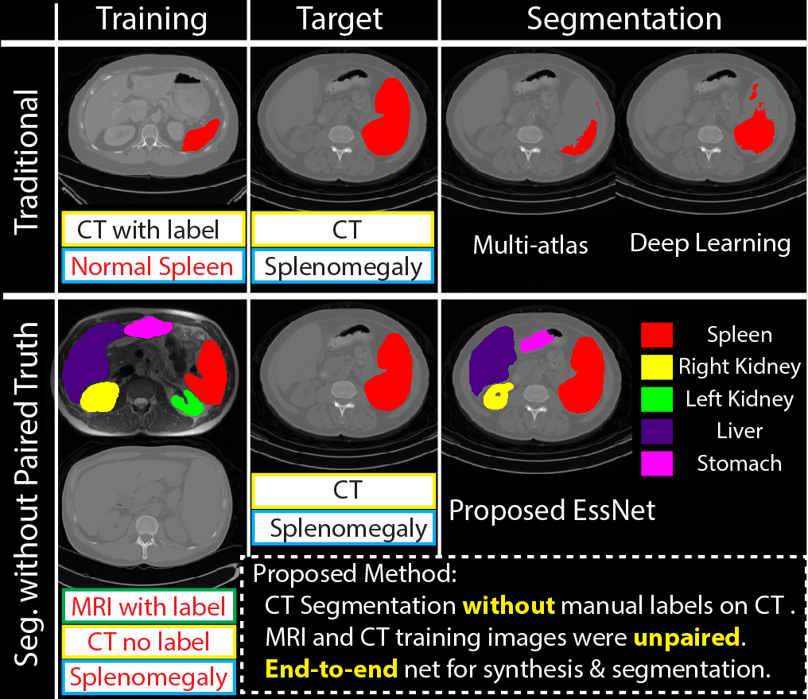

   

# Adversarial Synthesis Learning Enables Segmentation Without Target Modality Ground Truth

This is our ongoing PyTorch implementation for multi-model segmentation without groudtruth.

The code was written by [Yuankai Huo](https://sites.google.com/site/yuankaihuo/) and developed upon [CycleGAN Torch](https://github.com/junyanz/CycleGAN)
