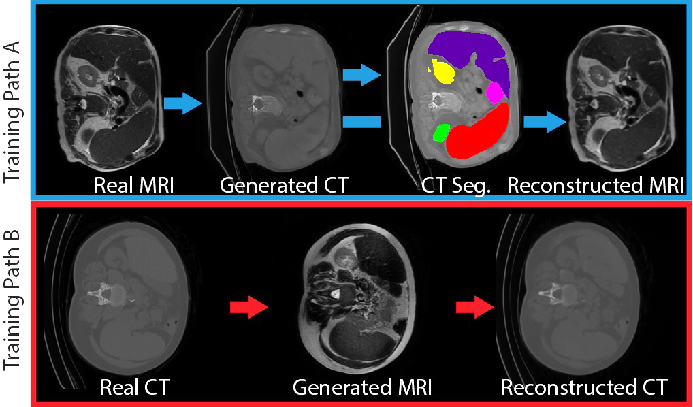
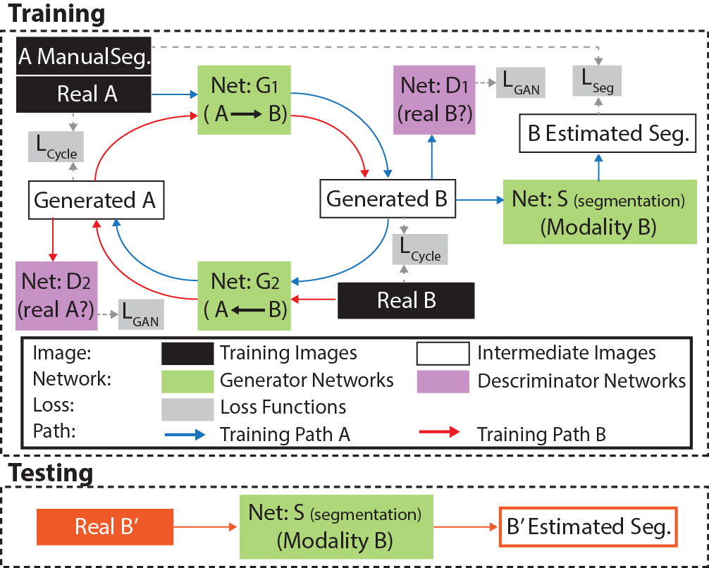

# EssNet 
(End-to-end Synthesis and Segmentation Network)

# Adversarial Synthesis Learning Enables Segmentation Without Target Modality Ground Truth

This is our ongoing PyTorch implementation for end-to-end synthesis and segmentation without groudtruth.
The paper can be found in [arXiv](https://arxiv.org/abs/1712.07695) for ISBI 2018

The code was written by [Yuankai Huo](https://sites.google.com/site/yuankaihuo/) and developed upon [CycleGAN Torch](https://github.com/junyanz/CycleGAN).

If you use this code for your research, please cite:

Huo et al., [Adversarial Synthesis Learning Enables Segmentation Without Target Modality Ground Truth.](https://arxiv.org/abs/1712.07695)  In [arXiv](https://arxiv.org/abs/1712.07695) 2017.   

## Prerequisites
- Linux or macOS
- Python 2
- CPU or NVIDIA GPU + CUDA CuDNN
- pytorch 0.2

## Training Data and Testing Data
We used MRI and CT 2D slices (from coronal view) as well as MRI segmentatons as training data.
We used CT 2D slices (from coronal view) as testing data
The data orgnization can be seen in the txt files in `sublist` directory

## Training
